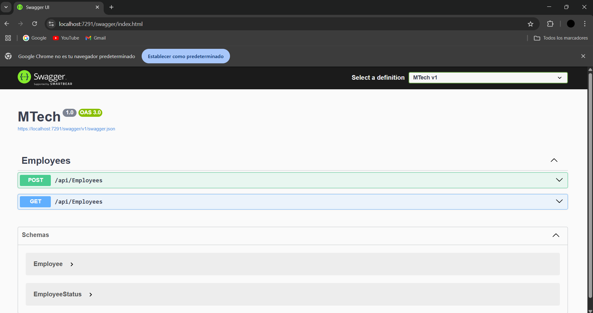
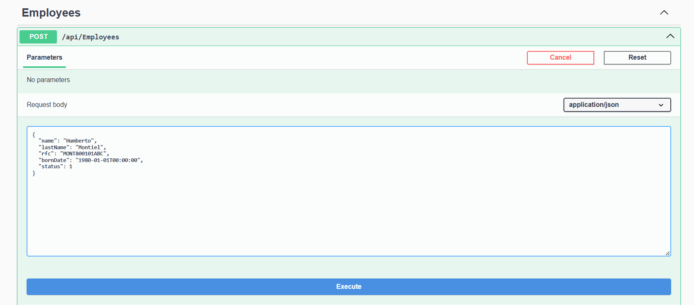
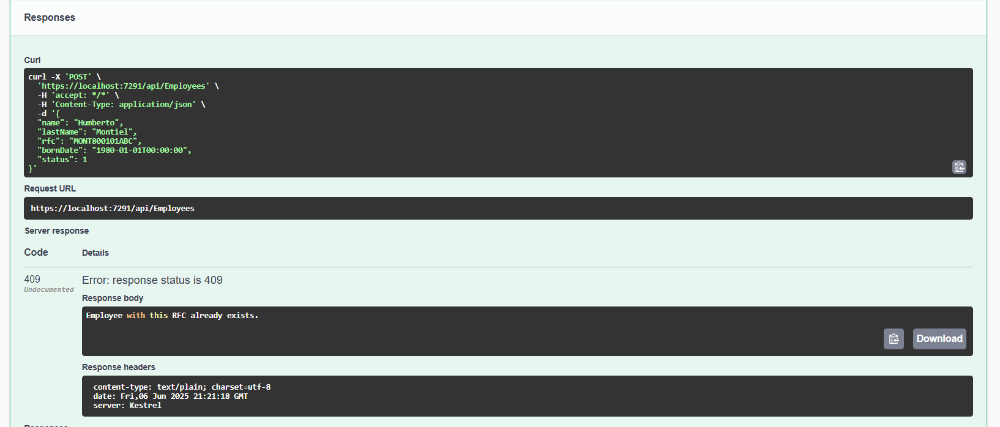
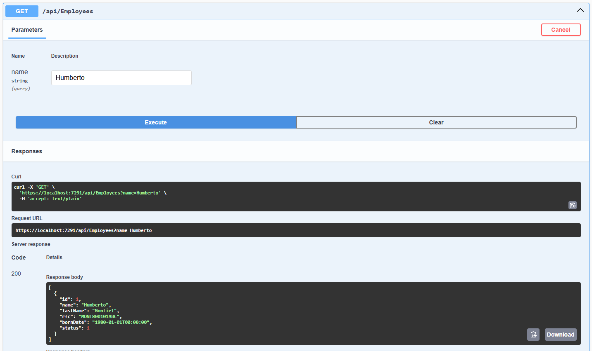
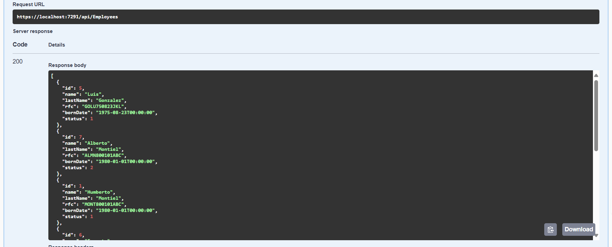

# MTech Employee API

This project is an API for managing employees, developed as a technical challenge for MTech.  
It allows you to store employees in a SQL Server database, validate RFC uniqueness and format, and query employees sorted by date of birth and optionally filtered by name.

## Features

- Store employees in SQL Server LocalDB
- Validate RFC (Mexican Tax ID) uniqueness and format
- Retrieve employees sorted by birth date, optional filter by name
- Automatic documentation with Swagger/OpenAPI
- Clean, commented, and extendable code

## Technologies

- ASP.NET Core 8.0
- Entity Framework Core
- SQL Server LocalDB
- Swagger / OpenAPI

## How to run the project

1. **Clone or download the repository**
2. **Restore NuGet packages** in Visual Studio
3. **Run the project**
    - Press F5 or click "Start Debugging"
    - Open `https://localhost:{port}/swagger` in your browser

## Sample POST request to /api/employees

```json
{
  "name": "Humberto",
  "lastName": "Montiel",
  "rfc": "MONT800101ABC",
  "bornDate": "1980-01-01T00:00:00",
  "status": 1
}

## 📸 Screenshots

### Swagger UI  
Visualiza y prueba los endpoints fácilmente desde el navegador.



---

### Crear un empleado (POST)  
Ejemplo de envío de datos para agregar un empleado nuevo:



**Respuesta de éxito:**



---

### Consultar empleados (GET)  
Filtrado por nombre y resultado general:

**GET por nombre**


**GET general**

